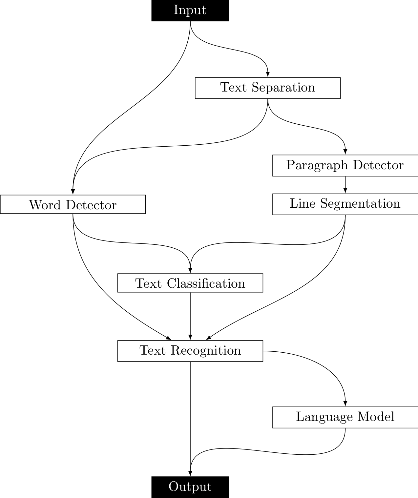

# End-to-End Recognition of Handwritten Notes in Scanned Documents

This repository contains all files necessary to train, run, and evaluate the sytem presented in the Master's Thesis "End-to-End Recognition of Handwritten Notes in Scanned Documents".
With the end-to-end system, you can transcribe (only the) handwritten notes on pages, even when they are mixing with printed text.
This repository does not include any models; however you can download some here or train them yourself.

A good dataset to train the model on is the [Paper Notes](https://www.github.com/torbenm/paper-notes) dataset.

In the following, the Training, Running, Evaluation (with Ceiling Analysis) is described.

## Setup

The system was implemented using Tensorflow 1.9, Python 3.7, CUDA 10, and cuDNN 7.4.
All networks were evaluated on a system with a GeForce GTX 1080 Ti GPU with about 11 GB of memory, an Intel i9-7900X CPU with 3.3 GHz, and about 64 GB of RAM.

To install the dependencies, run `pip install -r requirements.txt`.
There might be some missing even though I tried to keep the file complete.

## Training

The system is made up of several building blocks, which can be combined together:



In this section, training the deep learning components (i.e. Text Separation, Text Classification, Text Recognition) as well as setting up the Language Model is described.

### Gathering the data

First you should download the IAM dataset. For this, run

```
python -m data.download --dataset iam --user USERNAME --pwd PASSWORD
```

`PASSWORD` and `USERNAME` should be replaced with the respective values you set up to access the [IAM database](http://www.fki.inf.unibe.ch/databases/iam-handwriting-database).

Next, you need to prepare the datasets for training.
This can be done with

```
python -m data.prepare --config iam-both-small
```

The config parameter tells the program what configuration to consult. There are two configurations provided: `iam-both-small` and `iam-both-large`. You can create your own configurations by placing a `.json` file in the `/data/config/` folder.

If you want to base the splitting into train, test, dev on the Paper Notes dataset, you should run it with the following command.
Here, you of course should adjust the path yourself to the according folder.

```
python -m data.prepare --config iam-both-small --split ../paper-notes/data/final
```

The following options are available:

```jsonc
{
  "dataset": "iam", // The base dataset
  "subset": "both", // Which subset to use. "both" describes words and lines for iam
  "limit": -1, // Limit of samples (-1 is infinite)
  "shuffle": true, // Whether or not to shuffle
  "test_frac": 0.1, // Fraction for testing
  "dev_frac": 0.1, // Fraction for development
  "invert": true, // Whether to invert the files
  "threshold": false, // Whether to apply thresholding
  "crop": true, // Whether to crop the image to the smallest part of non-background pixels
  "scale": {
    "mode": "none" // How to scale the image. Modes are "factor",
    //"none", "height", "line" (see scale.py for more detail)
  },
  "padding": 5, // Number of pixels to padd with
  "binarize": false, // Whether to binarize
  "printed": {
    // If this option is included you add printed text versions
    "minlength": 2, // Minimum length of text to make it printed
    "count": [10000, 1000, 1000], // Number of samples per [train, dev, test]
    "padding": 5, // Padding to apply
    "printing_padding": 5, // padding of the printed text
    "crop": true, // Whether to crop the printed text
    "height": {
      "min": 10, // Minimum height
      "max": 110, // Maximum heihgt
      "center": [20, 40, 60, 80, 100], // Centers of gaussian distributions for random height selection
      "scale": 5
    },
    "foreground": {
      "low": 0, // The values the foreground pixels can be betrween
      "high": 0
    },
    "filters": [],
    "fonts": [
      // Which fonts to use
      "./data/fonts/AppleGaramond.ttf",
      "./data/fonts/Cursif.ttf",
      "./data/fonts/EnglishTowne.ttf",
      "./data/fonts/LinLibertine.ttf",
      "./data/fonts/OldNewspaperTypes.ttf",
      "./data/fonts/Roboto-Light.ttf",
      "./data/fonts/Asar-Regular.ttf",
      "./data/fonts/Bellefair-Regular.ttf",
      "./data/fonts/JosefinSlab-Thin.ttf",
      "./data/fonts/JosefinSlab-Light.ttf",
      "./data/fonts/Lato-LightItalic.ttf",
      "./data/fonts/Lato-Hairline.ttf",
      "./data/fonts/LibreBaskerville-Italic.ttf",
      "./data/fonts/LibreBaskerville-Regular.ttf",
      "./data/fonts/PlayfairDisplay-BoldItalic.ttf",
      "./data/fonts/PlayfairDisplay-Regular.ttf",
      "./data/fonts/Tangerine-Regular.ttf",
      "./data/fonts/TulpenOne-Regular.ttf",
      "./data/fonts/Ubuntu-MediumItalic.ttf",
      "./data/fonts/IMFeENsc28P.ttf"
    ]
  }
}
```

### Text Separation

To train the `Text Separation Network`, you first need to define a configuration file. In my thesis, I used `config/separation/base.json`.
Here are some of the options.

```jsonc
{
  "name": "separation", // name of the configuration
  "save": 2, // after which epoch to make a checkpoint (here, every second epoch)
  "binary": true, // Whether to binarize the data
  "max_batches": {
    "sep": {
      // MAximum number of batches per subset
      "train": 1000,
      "val": 1000 // same as "dev"
    }
  },
  "data_config": {
    // How the page should be separated into tiles/slices
    "slice_width": 512,
    "slice_height": 512,
    "filter": true, // Whether to filter out slices without handwriting
    "otf_augmentations": {} // see data/ImageAugmenter.py for options
    // empty object means no augmentations are applied
    // otf stands for "on the fly", thus there will be no two batches alike
  },
  "batch": 4, // Size of a batch
  "learning_rate": 0.0000001, // Size of the learning rate
  "algo_config": {
    "filter_size": 5, // Filter size of the convolutions
    "features_root": 32, // Number of features in the first convolution (doubled every contracting block)
    "batch_norm": false, // whether to use batch norm
    "group_norm": 32 // whether to use group norm and the group size
    // ...  more options can be found in ./nn/tfunet.py
  }
}
```

To start the actual training, execute

```sh
python train_separation.py [--gpu GPU] [--model-date] [--model-epoch]
```

You should pass a GPU parameter with the index of the GPU to use. Default is `-1`, thus CPU execution.
The model snapshots are stored in `models/$NAME_OF_THE_CONFIG_$CURRENT_DATE/`. Therefore, if you want to continue training an existing model, you should pass `--model-date` set to the according date and `--model-epoch` to the epoch where you want to continue.

### Text Classification & Recognition

## Running

### Single Building Blocks

### A whole pipeline

## Evaluating

## Ceiling Analysis
